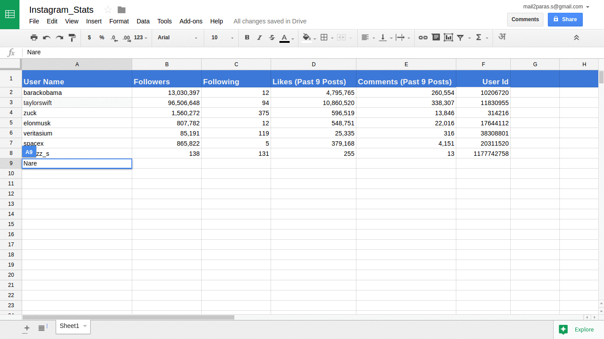

# Instagram_Google-Sheets
##Google Apps Script to fetch data from instagram and display in Google Sheets.
***

***
`insta_function.gs fetches data without api does not fetches likes and comment data for private account`
`insta_function_api.gs is based on instagram api, use your API token to get data from instagram`
***
[Check out an example here](https://docs.google.com/spreadsheets/d/1KwO0MWjipz2AK61lu7a12mHESQ787WsLxqZuXB-bqYA/edit?usp=sharing)
